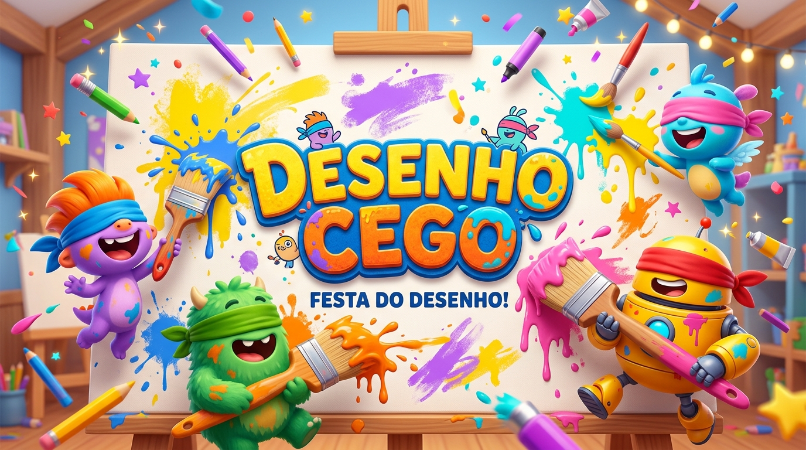

# 🎨 Desenho Cego — Party Edition 🚀

> **O party game multiplayer em tempo real onde você desenha no desespero seguindo apenas as pistas de um amigo!**  
> *Inspirado na energia caótica de jogos como Gartic Phone e Jackbox Party Pack.*

---

<p align="center">
  
</p>

<p align="center">
  
  
  
  
  
  
  
</p>

---

## 🎮 Como Funciona a Brincadeira?

O **Desenho Cego** é um jogo de desenho colaborativo e dedução em rodadas:

```
[ 1. Dicas do Mestre ] ──➔ [ 2. Desenho às Cegas ] ──➔ [ 3. Votação & Risadas ] ──➔ [ 4. Pódio & Campeão ]
```

1. **👑 O Mestre da Rodada**:
   - Um jogador é sorteado como Mestre e recebe um personagem secreto (ex: *Pikachu*, *Shrek*, *Monalisa*).
   - O Mestre **NUNCA** pode falar o nome do personagem nem de onde ele é! Ele deve enviar dicas visuais puras (*"Tem orelhas pontudas"*, *"É amarelo com bochechas vermelhas"*, *"Parece um rato elétrico"*).
2. **🎨 Os Artistas (Desenho às Cegas)**:
   - Todos os outros jogadores ouvem/leem as dicas e tentam desenhar o personagem em tempo real.
   - **Regra de Ouro**: Não existe Ctrl+Z (desfazer)! O charme do jogo está nos erros e nas tentativas malucas.
3. **🗳️ A Galeria de Votação**:
   - Ao final do tempo, todos os desenhos são revelados anonimamente na galeria.
   - Cada jogador vota em 2 categorias:
     - 🎨 **Mais Parecido** *(Troféu Picasso)*: Para quem conseguiu captar a essência do personagem.
     - 😂 **Maior Atrocidade** *(Troféu Meme)*: Para o desenho mais bizarro e hilário da rodada.
4. **🏆 Resultados & Torneio**:
   - O personagem secreto é revelado!
   - Os votos viram pontos, acumulando na classificação geral até consagrar o **Grande Campeão do Torneio**.

---

## ✨ Funcionalidades & Destaques

- ⚡ **Multiplayer em Tempo Real**: Sincronização instantânea de jogadores, salas, timers e votos usando **WebSockets (Socket.io)**.
- 💬 **Reações Flutuantes ao Vivo**: Barra inferior para enviar reações de emojis (`😂`, `🔥`, `👏`, `😱`, `🎨`, `💩`) que sobem flutuando na tela de todos os participantes.
- ⚙️ **Configurações da Sala (Host)**: O criador da sala pode escolher o tempo de cada rodada (60s, 90s, 120s) e o total de rodadas do torneio (3, 5 ou Infinito).
- 📲 **Convite com 1 Clique**:
  - Botão para **Copiar Link** com código automático (`?room=XYZ`).
  - Botão nativo para **Convidar no WhatsApp** com mensagem pronta.
- 🎲 **Gerador de Apelidos Cômicos**: Botão com dado que gera apelidos engraçados em 1 clique (*"Capivara Ninja"*, *"Picasso da Shopee"*, *"Monalisa do Pagode"*).
- 🖼️ **Download de Desenhos em PNG**: Salve qualquer desenho da galeria, dos prêmios ou no zoom com 1 clique para compartilhar em grupos ou transformar em figurinhas.
- 🔊 **Efeitos Sonoros Procedurais**: Sons táteis de cliques, pops, ticks de contagem regressiva e fanfarra de vitória sintetizados nativamente com a **Web Audio API** (0 dependências de arquivos de áudio externos!).
- 📱 **Suporte Total para Celular e Desktop**: Canvas com trava de rolagem touch para desenho preciso em smartphones e tablets.
- 🚀 **Pronto para Deploy**: Fluxo automático de deploy no **GitHub Pages** via GitHub Actions configurado.

---

## 🛠️ Tecnologias Utilizadas

### Front-end
| Tecnologia | Função |
|---|---|
| **React 19** | Biblioteca de interface reativa |
| **TypeScript** | Segurança e tipagem estática do código |
| **Vite** | Bundler ultra-rápido com HMR |
| **Tailwind CSS v4** | Estilização moderna e responsiva |
| **Framer Motion** | Animações fluidas, transições de tela e reações elásticas |
| **Lucide React** | Ícones consistentes em estilo outline |
| **Canvas-Confetti** | Chuva de confetes comemorativa no pódio |
| **Socket.io Client** | Comunicação bidirecional com o servidor |

### Back-end
| Tecnologia | Função |
|---|---|
| **Node.js** | Ambiente de execução JavaScript |
| **Express** | Servidor HTTP e endpoints base |
| **Socket.io** | Gerenciamento de salas, timers e eventos de jogo |
| **CORS** | Controle de acesso entre domínios |

---

## 🚀 Como Rodar o Projeto Localmente

### Pré-requisitos
- Ter o **Node.js** (versão 18 ou superior) instalado em sua máquina.
- Ter o gerenciador de pacotes **npm**.

### 1. Clonar o Repositório
```bash
git clone https://github.com/euopedror/tipo_o_gartic.git
cd tipo_o_gartic
```

### 2. Iniciar o Servidor Back-end
Abra um terminal:
```bash
cd backend
npm install
npm run dev
```
> O servidor iniciará na porta **`3001`**: `http://localhost:3001`

### 3. Iniciar o Front-end
Abra um segundo terminal:
```bash
cd frontend
npm install
npm run dev
```
> O front-end iniciará na porta **`5173`**: `http://localhost:5173`

Pronto! Acesse `http://localhost:5173` no seu navegador para jogar. Para simular outros jogadores, basta abrir abas anônimas adicionais ou entrar pelo celular conectado na mesma rede Wi-Fi!

---

## 🌐 Como Publicar Online

Como se trata de um jogo multiplayer, o projeto é composto por duas partes:

```
[ Frontend Estático no GitHub Pages ]  ──WebSocket──>  [ Backend Node.js no Render/Railway ]
```

### 1. Publicar o Front-end no GitHub Pages
O projeto já conta com o fluxo do **GitHub Actions** configurado em `.github/workflows/deploy.yml`:
1. Faça o commit e envie as alterações para o seu repositório no GitHub (`git push origin main`).
2. No seu repositório no GitHub, vá em:
   - **Settings** ➔ **Pages**.
   - Em **Build and deployment** ➔ **Source**, selecione **GitHub Actions**.
3. O GitHub compilará e publicará o site automaticamente com uma URL pública (ex: `https://seu-usuario.github.io/tipo_o_gartic/`).

### 2. Publicar o Back-end no Render (100% Gratuito)
1. Crie uma conta gratuita no [Render.com](https://render.com).
2. Clique em **New +** ➔ **Web Service**.
3. Conecte o repositório do jogo e configure:
   - **Root Directory**: `backend`
   - **Build Command**: `npm install`
   - **Start Command**: `node index.js`
4. Ao concluir, o Render fornecerá a URL pública do seu servidor (ex: `https://desenho-cego-backend.onrender.com`).
5. No GitHub do seu frontend, crie o segredo/variável `VITE_BACKEND_URL` apontando para a URL do Render, e o frontend se conectará automaticamente na nuvem!

---

## 📂 Estrutura de Arquivos

```
tipo_o_gartic/
├── .github/
│   └── workflows/
│       └── deploy.yml            # CI/CD para deploy automático no GitHub Pages
├── backend/
│   ├── index.js                  # Lógica do jogo, salas, timers e Socket.io
│   └── package.json
├── frontend/
│   ├── public/
│   │   ├── banner.jpg            # Banner principal em arte 3D estilo Pixar
│   │   └── wallpaper.jpg         # Papel de parede temático de estúdio de arte
│   ├── src/
│   │   ├── components/
│   │   │   ├── common/
│   │   │   │   ├── AvatarPicker.tsx       # Seletor de avatares com adesivos temáticos
│   │   │   │   └── FloatingReactions.tsx  # Barra e animação de emojis flutuantes
│   │   │   ├── Game.tsx                   # Canvas de desenho e painel do Mestre
│   │   │   ├── Lobby.tsx                  # Tela inicial, apelidos e entrada na sala
│   │   │   ├── Results.tsx                # Resultados, revelação secreta e Grande Campeão
│   │   │   └── Voting.tsx                 # Galeria de votação (Picasso vs Atrocidade)
│   │   ├── utils/
│   │   │   ├── audioFx.ts                 # Efeitos sonoros procedurais (Web Audio API)
│   │   │   ├── characterIdeas.ts          # Banco de ideias e sugestões de personagens
│   │   │   └── downloadDrawing.ts         # Utilitário de exportação de arte em PNG
│   │   ├── App.tsx                        # Roteamento de estados da sala e conexão
│   │   ├── index.css                      # Tailwind v4, estilos arcade e neon
│   │   ├── main.tsx                       # Ponto de entrada do React
│   │   └── types.ts                       # Tipagens completas do jogo
│   ├── index.html
│   ├── package.json
│   └── vite.config.ts
└── README.md
```

---

## 📜 Licença

Este projeto é distribuído sob a licença [MIT](LICENSE). Sinta-se livre para clonar, modificar, jogar com os amigos e contribuir!

---

<p align="center">
  Feito com muita criatividade, risadas e carinho para noites de jogos inesquecíveis! 🎨✨
</p>
